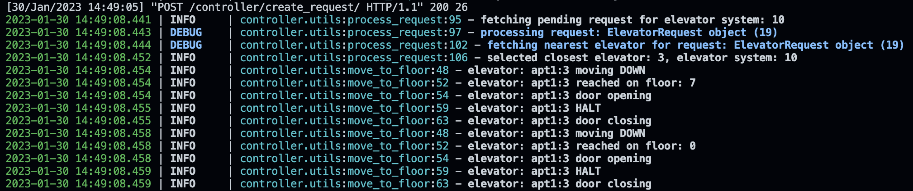

# Elevator-System

This projects aims providing a utility for creating and managing an elevator system for a building by exposing RESTful API endpoints to interact with the system.
.


# Features

- Create new elevator system with N number of elevators.

- Get details of all the elevators in the elevator-system at any point in time.

- Get details of specific elevator at any point in time. 

- Make a request to go from one floor to other, and the controller system will automatically select the closet lift to the user

- Mark any lift under maintenance and working status.


# Installation

Install elevator-system with pip

```bash
  pip install requirements.txt
```

Build docker image

```bash
docker build -t elevator_system .
```

# Running the server

run django server locally

```bash
python manage.py runserver 0.0.0.0:8000
```

Run in a docker container using the image built in previous stage

```bash 
docker run -d --name elevator-system -p 8000:8000 elevator_system
```
    
# Executing test cases
run the below command from the roor directory of the project
```bash
pytest
```

# Design

## Directory Structure
<!--  -->


- The main app is the elevator_system and controller app controls the movement of all the elevator with a system, It also house all the API for a elevator system.

- the `controller/utils.py` module has the utility functions to create the elevator-system and also processing the requests

## Database Design


## Approach

- There is only 1 button on each floor, so for each request optimal elevator should be selected.

- when the User calls for an elevator from floor x, the system get the status of all the elevators and selects the elevator which is working and closet to floor x. 

- Each request is processed by a request processor running on separate Thead, which fetches and process request from `ElevatorRequest` table

- The request process fetches request at an interval of every  `4 seconds`, which can be adjusted in the parameters.

- Steps taken in processing each request can be seen in the logs for each request. 
